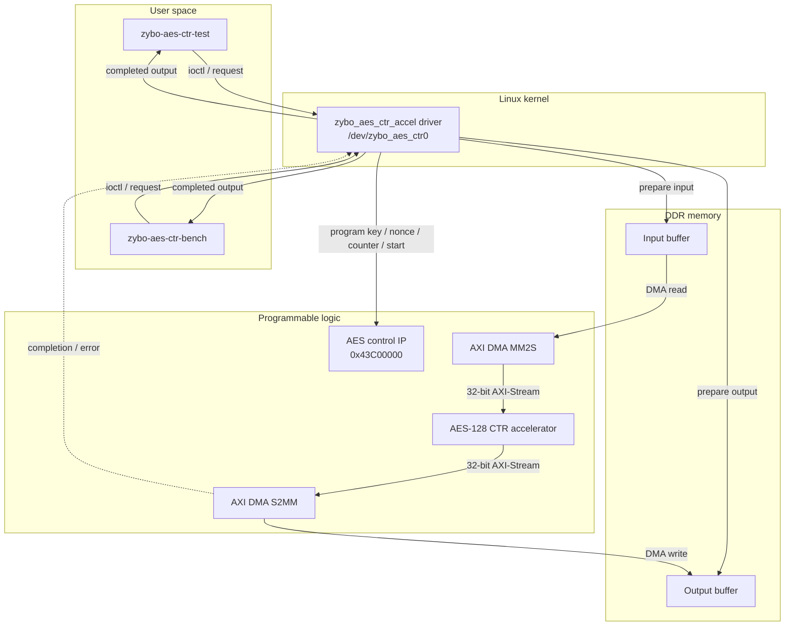
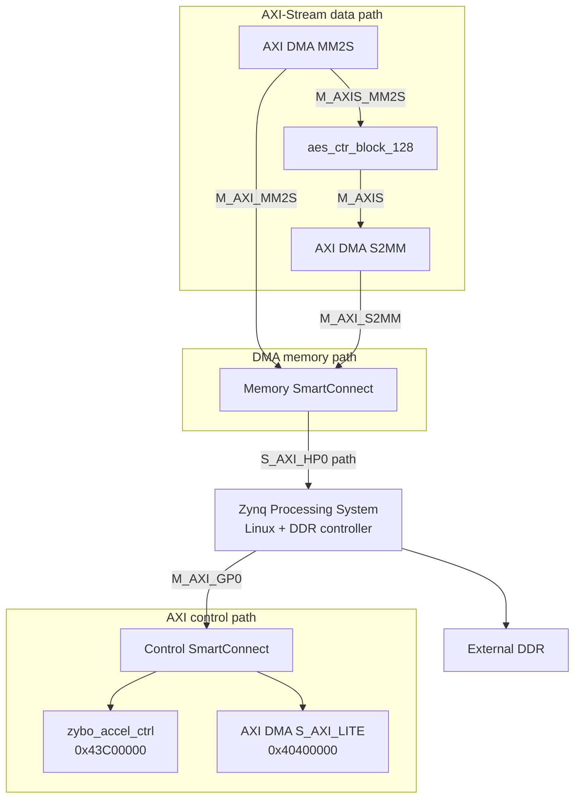

# Architecture

## 1. Purpose and current scope

This project implements a Linux-controlled AES-128 CTR FPGA accelerator on the
Digilent Zybo Z7-20.

Linux runs on the Zynq processing system. User-space software submits AES-CTR
requests through a custom Linux kernel driver. The driver configures the FPGA
accelerator, coordinates DMA transfers between DDR and programmable logic, waits
for completion, and returns the processed output to software for validation or
benchmarking.

The programmable-logic processing path performs AES-128 in CTR mode. Input data
is streamed from DDR through AXI DMA, transformed by the AES-CTR accelerator,
and written back to DDR through the return DMA channel.

This architecture document describes:

- the relationship to the reusable base platform,
- the Linux/software responsibility split,
- the Vivado hardware topology,
- control and data paths,
- DMA and device-tree integration,
- the AES-CTR accelerator boundary,
- kernel-driver responsibilities,
- user-space applications,
- PetaLinux integration,
- the verified system boundary.

Detailed clock-by-clock RTL behavior, internal state sequencing, collector and
serializer behavior, AES round organization, and RTL-level parallelism are
documented separately in `docs/rtl-design.md`.

---

## 2. Relationship to the base platform

This repository extends the pinned Linux-FPGA acceleration platform contained
in:

```text
platform/
```

The base platform established and verified the reusable infrastructure required
for Linux-controlled FPGA acceleration on the Zybo Z7-20.

The platform provides the foundation for:

- Zynq processing-system integration,
- DDR access,
- AXI-Lite software control,
- AXI DMA data movement,
- the programmable-logic clock/reset infrastructure,
- DMA interrupt delivery,
- Linux/PetaLinux integration,
- the driver-controlled accelerator execution model.

The AES repository reuses that infrastructure while replacing the original
simple validation datapath with the AES-128 CTR accelerator and extending the
software/control interfaces required by AES.

The AES-specific repository adds:

- the AES-128 CTR VHDL implementation,
- HDL Designer project metadata,
- AES-specific RTL verification,
- an AES-extended AXI-Lite control IP,
- Vivado integration for the AES datapath,
- an AES-specific Linux kernel driver,
- AES functional-validation software,
- AES benchmarking software,
- AES-specific PetaLinux package selection and recipes.

The platform remains pinned as a Git submodule instead of duplicating its
common infrastructure inside this repository.

---

## 3. Target platform

| Item | Current target |
|---|---|
| Board | Digilent Zybo Z7-20 |
| SoC | Xilinx Zynq-7020 |
| FPGA part | XC7Z020-1CLG400C |
| Hardware design tool | Vivado 2025.2 |
| Linux build tool | PetaLinux 2025.2 |
| Linux build host | Ubuntu 22.04.5 LTS |

---

## 4. Responsibility split

The complete system is divided into four primary responsibility domains.

### 4.1 User-space software

User-space applications are responsible for:

- preparing input data,
- preparing AES key, nonce, and initial-counter values,
- submitting requests to the kernel driver,
- receiving completed output,
- comparing FPGA output against a software reference,
- reporting functional-validation results,
- measuring FPGA and CPU performance.

User applications do not directly control AXI DMA registers or map the FPGA
control registers.

### 4.2 Linux kernel driver

The custom AES driver is the controlled interface between user space and the
FPGA subsystem.

The driver:

- binds to the AES accelerator device-tree node,
- maps the AES control register block,
- requests the DMAEngine channels,
- validates user requests,
- programs AES control parameters,
- prepares input and output DMA transfers,
- starts the AES operation,
- waits for completion,
- handles timeout and error conditions,
- returns processed output to user space.

The driver exposes:

```text
/dev/zybo_aes_ctr0
```

### 4.3 Programmable logic

The programmable-logic design contains:

- the AES-extended AXI-Lite control IP,
- AXI DMA,
- the AES-128 CTR streaming accelerator,
- AXI interconnect infrastructure,
- clock/reset distribution,
- interrupt integration.

### 4.4 DDR-backed transfer memory

Input and output buffers reside in DDR memory.

AXI DMA performs the bulk data movement:

```text
DDR input
   |
   v
MM2S
   |
   v
AES-CTR
   |
   v
S2MM
   |
   v
DDR output
```

The processing system retains ownership of the application buffers while DMA
provides the high-throughput memory-to-stream and stream-to-memory paths.

---

## 5. System-level architecture



The system separates control from bulk data movement.

The AXI-Lite path configures the accelerator and exposes status.

The DMA/AXI-Stream path carries the actual input and output payload.

---

## 6. End-to-end transaction model

A normal AES-CTR request proceeds as follows:

1. A user-space application opens:

   ```text
   /dev/zybo_aes_ctr0
   ```

2. The application prepares:
   - input data,
   - AES-128 key,
   - 96-bit nonce,
   - 32-bit initial counter.

3. The application submits the request through the driver.

4. The driver validates the request, including the transfer length.

5. The driver prepares the DMA receive path for the FPGA output.

6. The driver prepares the DMA transmit path for the FPGA input.

7. The driver writes the AES parameters to the control IP.

8. The driver issues the accelerator start operation.

9. AXI DMA MM2S reads the input buffer from DDR.

10. The input stream enters the AES-CTR accelerator.

11. The accelerator generates CTR keystream blocks and XORs them with the
    payload.

12. The transformed output stream enters AXI DMA S2MM.

13. AXI DMA writes the result to the output DDR buffer.

14. The driver waits for completion or reports a timeout/error.

15. The completed data is returned to the user-space application.

16. Validation software compares the FPGA result against its software AES-CTR
    reference.

This is the central hardware/software transaction performed by the final
system.

---

## 7. Hardware/IP-level architecture

The Vivado design contains three important paths:

- control,
- streaming data,
- DMA memory access.



The AES control IP and AXI DMA control interface are software-visible through
AXI-Lite.

The high-volume data path does not pass through AXI-Lite. It uses AXI DMA and
AXI-Stream.

---

## 8. Implemented hardware blocks

| Block | Role |
|---|---|
| Zynq Processing System | Runs Linux, owns DDR, provides AXI control and high-performance memory access |
| Control SmartConnect | Routes PS AXI control traffic to the custom control IP and AXI DMA |
| `zybo_accel_ctrl` | AES-extended AXI-Lite control and status interface |
| AXI DMA | Transfers buffers between DDR and the AES AXI-Stream path |
| AES-CTR accelerator | Performs AES-128 CTR transformation on the streamed payload |
| Memory SmartConnect | Connects DMA memory-side masters to the PS DDR access path |
| Processor System Reset | Provides synchronized programmable-logic resets |
| Interrupt integration | Delivers DMA completion/error interrupt signals to the processing system |

---

## 9. Control path

### 9.1 Control-IP address

The AES-extended control IP is mapped at:

```text
0x43C00000
```

with a 64 KiB address range.

### 9.2 Register map

The implemented software-visible register map is:

| Offset | Register | Purpose |
|---|---|---|
| `0x00` | `VERSION` | Hardware version |
| `0x04` | `SCRATCH` | Read/write regression register |
| `0x08` | `AES_CONTROL` | AES operation control |
| `0x0C` | `AES_STATUS` | AES idle/busy state |
| `0x10` | `AES_KEY_0` | AES key word 0 |
| `0x14` | `AES_KEY_1` | AES key word 1 |
| `0x18` | `AES_KEY_2` | AES key word 2 |
| `0x1C` | `AES_KEY_3` | AES key word 3 |
| `0x20` | `AES_NONCE_0` | AES nonce word 0 |
| `0x24` | `AES_NONCE_1` | AES nonce word 1 |
| `0x28` | `AES_NONCE_2` | AES nonce word 2 |
| `0x2C` | `AES_INITIAL_COUNTER` | Initial 32-bit CTR counter |

### 9.3 AES control

`AES_CONTROL` bit 0 generates the accelerator start request.

The control IP produces the corresponding AES start signal as a one-cycle
control event.

### 9.4 AES status

`AES_STATUS` exposes the current accelerator state.

The implemented status fields are:

| Bit | Meaning |
|---|---|
| `0` | idle |
| `1` | busy |

The AES accelerator provides the idle indication back to the AXI-Lite control
block.

### 9.5 AES parameters

The control interface provides:

```text
AES key          128 bits
nonce             96 bits
initial counter   32 bits
```

Together, the 96-bit nonce and 32-bit counter define the 128-bit counter block
used by CTR processing.

---

## 10. DMA and streaming data path

### 10.1 AXI DMA configuration

The AXI DMA control interface is mapped at:

```text
0x40400000
```

The implemented system uses:

- MM2S for memory-to-stream transfers,
- S2MM for stream-to-memory transfers,
- simple DMA operation,
- a 21-bit DMA buffer-length configuration.

The current driver policy limits individual accelerator requests to:

```text
1 MiB
```

### 10.2 Stream topology

The programmable-logic stream path is:

```text
AXI DMA MM2S
      |
      v
AES-128 CTR
      |
      v
AXI DMA S2MM
```

The AES-CTR datapath uses 32-bit AXI-Stream interfaces externally.

### 10.3 DMA channel ownership

The Linux driver uses the DMAEngine framework.

The accelerator device-tree node associates the two channels as:

```dts
&zybo_accel_ctrl_0 {
    dmas = <&axi_dma_0 0>, <&axi_dma_0 1>;
    dma-names = "tx", "rx";
};
```

The names correspond to:

| DMA name | Hardware direction | Function |
|---|---|---|
| `"tx"` | MM2S | DDR memory to AES stream input |
| `"rx"` | S2MM | AES stream output to DDR memory |

The driver requests the channels by these names instead of exposing AXI DMA
registers directly to user space.

---

## 11. AES-CTR accelerator boundary

At the system-architecture level, the AES accelerator can be viewed as a
streaming transformation block with a separate configuration/control
interface.

### Inputs

The accelerator receives:

- 32-bit AXI-Stream input data,
- stream handshake/control information,
- 128-bit AES key,
- 96-bit nonce,
- 32-bit initial counter,
- start control,
- clock and reset.

### Outputs

The accelerator produces:

- 32-bit AXI-Stream transformed output,
- output stream handshake/control information,
- idle status.

### High-level processing model

Internally, the AES-CTR design performs the following logical functions:

```text
AXI-Stream input
       |
       v
Input collection
       |
       +-----------------------+
       |                       |
       v                       |
Payload block                  |
                               |
Nonce + counter                |
       |                       |
       v                       |
AES-128 encryption             |
       |                       |
       v                       |
Keystream block                |
       |                       |
       +---------- XOR <-------+
                   |
                   v
          Processed payload
                   |
                   v
          Output serialization
                   |
                   v
          AXI-Stream output
```

The detailed implementation of:

- input collection,
- output serialization,
- AES round sequencing,
- state control,
- counter progression,
- partial-block handling,
- AXI-Stream backpressure,
- block-to-block sequencing,
- internal parallelism,

belongs to `docs/rtl-design.md`.

---

## 12. AES-CTR mode at the system boundary

CTR mode does not directly encrypt the input payload with the AES block.

Instead, for each 128-bit logical payload block, the accelerator forms a
counter input from:

```text
96-bit nonce || 32-bit counter
```

That 128-bit value is encrypted using AES-128.

Conceptually:

```text
keystream = AES128(key, nonce || counter)

output = input XOR keystream
```

The counter progresses across successive AES-CTR blocks.

CTR mode therefore uses the AES encryption datapath for both encryption and
decryption; the difference is entirely in the data supplied to the XOR stage.

The detailed byte ordering, counter sequencing, valid-byte handling, and
clocked implementation are documented with the RTL design rather than in this
system-level architecture description.

---

## 13. HDL Designer and Vivado source relationship

The AES RTL is maintained as an HDL Designer project.

The project entry point is:

```text
hardware/hdl_designer/zybo_aes_hdl.hdp
```

The actual VHDL files consumed by Vivado are stored under:

```text
hardware/hdl_designer/zybo_aes_hdl_lib/hdl/
```

The repository intentionally does not contain a second copied RTL tree.

The Vivado recreation script adds the VHDL files directly from the HDL Designer
source directory.

The block-design recreation source is:

```text
hardware/vivado/create_block_design.tcl
```

The project recreation entry point is:

```text
hardware/vivado/create_project.tcl
```

This preserves one authoritative RTL source location for the AES design.

---

## 14. Linux driver architecture

The AES kernel driver source is:

```text
linux/driver/zybo_aes_ctr_accel.c
```

The shared user/kernel interface definition is:

```text
linux/driver/zybo_aes_ctr_accel_uapi.h
```

The driver exposes:

```text
/dev/zybo_aes_ctr0
```

### 14.1 Device-tree binding

The driver matches:

```text
xlnx,zybo-accel-ctrl-1.0
```

which matches the generated FPGA control node.

### 14.2 Driver responsibilities

The driver is responsible for:

- platform-device binding,
- AES control-register mapping,
- DMA channel acquisition,
- request validation,
- transfer-size policy enforcement,
- AES parameter programming,
- accelerator start sequencing,
- DMA submission,
- completion waiting,
- timeout handling,
- DMA error handling,
- returning completed output to user space.

### 14.3 Execution model

The current driver uses a blocking request model.

A submitted operation returns after:

- successful completion,
- timeout,
- or error.

This keeps transaction ownership and validation straightforward for the current
accelerator implementation.

### 14.4 Transfer-size policy

The current maximum supported request size is:

```text
1 MiB
```

This is a driver policy consistent with the current DMA configuration.

---

## 15. User-space applications

The final AES repository contains two primary target-side applications.

| Program | Purpose |
|---|---|
| `zybo-aes-ctr-test` | Functional validation of the FPGA AES-CTR path |
| `zybo-aes-ctr-bench` | FPGA/CPU AES-CTR performance comparison and correctness checking |

### 15.1 Functional validation

The functional validation application:

- prepares deterministic AES-CTR test inputs,
- submits requests through the driver,
- receives the FPGA output,
- generates the expected software result,
- compares hardware and software output,
- reports failures if any mismatch occurs.

### 15.2 Benchmark

The benchmark application measures AES-CTR processing across a range of
transfer sizes.

It compares:

- FPGA accelerator throughput,
- CPU software AES-CTR throughput,

while also checking correctness.

The largest current benchmark transfer size is:

```text
1 MiB
```

---

## 16. PetaLinux integration architecture

The AES repository deliberately uses the pinned platform PetaLinux snapshot as
its base.

A fresh Linux project is constructed as:

```text
fresh PetaLinux Zynq project
        |
        v
AES XSA import
        |
        v
platform project-spec snapshot
        |
        v
AES project-spec overlay
        |
        v
PetaLinux configuration
        |
        v
Linux image build
```

The platform snapshot provides the common Linux-FPGA base.

The AES-specific overlay supplies:

- AES rootfs package selection,
- `zybo-aes-ctr-accel`,
- `zybo-aes-ctr-test`,
- `zybo-aes-ctr-bench`,
- final AES-system image customization.

The final rootfs enables:

```text
CONFIG_zybo-aes-ctr-accel=y
CONFIG_zybo-aes-ctr-bench=y
CONFIG_zybo-aes-ctr-test=y
```

---

## 17. Verification architecture

Verification is performed at multiple levels.

### 17.1 RTL verification

The AES RTL has an independent ModelSim regression suite under:

```text
tests/rtl/modelsim/
```

The suite contains 11 tests covering:

- reset behavior,
- NIST AES-CTR vectors,
- input handshaking,
- output backpressure,
- partial blocks,
- busy-start behavior,
- counter behavior,
- reset during operation,
- multiple transactions,
- continuous streaming,
- randomized stress.

The final RTL regression result is:

```text
16,955 checks
0 failures
```

Detailed RTL verification behavior belongs with the RTL design documentation.

### 17.2 Linux/system validation

The final integrated AES hardware/software system has been functionally tested
on the Zybo Z7-20.

The Linux validation path confirms:

- device-driver operation,
- AES parameter configuration,
- DMA transfer execution,
- FPGA output correctness,
- software-reference agreement.

### 17.3 Clean-build verification

The public-repository PetaLinux reproduction flow was also verified from a fresh
project.

The clean build confirmed:

- successful AES XSA import,
- successful application of the platform base,
- successful application of the AES overlay,
- successful PetaLinux configuration,
- successful Linux image build,
- inclusion of the AES driver package,
- inclusion of both AES user applications,
- final compiled DTB DMA binding for `tx` and `rx`.

---

## 18. Current verified result

The current system represents a complete AES-128 CTR accelerator integration on
the Zybo Z7-20.

Verified implementation results include:

- working AES-128 CTR programmable-logic datapath,
- working AXI DMA input/output path,
- working AES AXI-Lite control interface,
- working Linux driver,
- working `/dev/zybo_aes_ctr0`,
- working functional-validation application,
- working benchmark application,
- 11 RTL regression tests,
- 16,955 RTL checks,
- zero RTL failures.

The final 1 MiB benchmark result was:

```text
FPGA AES-CTR throughput : 32.087 MiB/s
CPU AES-CTR throughput  : 3.257 MiB/s
Speedup                 : approximately 9.85x
```

---

## 19. Current implementation boundary

The current architecture is complete for the implemented AES-CTR accelerator,
but its responsibility boundary is intentionally clear.

The current system:

- keeps Linux responsible for request preparation,
- keeps Linux responsible for result validation,
- performs AES-CTR transformation in programmable logic,
- uses DMA for payload movement,
- uses AXI-Lite for accelerator configuration/status,
- uses a blocking driver request model,
- uses a current 1 MiB maximum transfer policy,
- does not implement networking protocols in programmable logic,
- does not expose AXI DMA registers directly to user space.

The detailed behavior of the AES RTL itself is intentionally separated from
this system-level document.

See:

```text
docs/rtl-design.md
```

for the accelerator microarchitecture, clocked behavior, state sequencing,
collector/serializer operation, AES core organization, counter progression,
partial-block handling, backpressure behavior, and internal concurrency.
